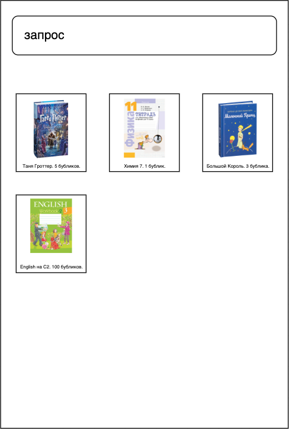

# Поиск 1. Моки внешних зависимостей

Оценка:

Дедлайн:

Решение поместите в директорию `/solution/search_1/`.

В некоторых местах условия вы будете встречать вопросы с номером.
Ответы на них вы можете поместить в pdf отчёт под соответствующими номерами.

## Рекомендации при выборе языка программирования

При выборе языка программирования для выполнения данной задачи
обратите внимание на несколько важных аспектов:
1. Возможность написания тестов.
2. Возможность работы с json.
В случае Python, Go или Rust эти проблемы решены на уровне языка.
В случае C++ вы можете обратить внимание на gtest и 
[nlohmann/json](https://github.com/nlohmann/json).

## Задание

В вашей компании tyndra, специализирующейся на продаже книг 
и всего, что с ними связано, разрабатывается удобное приложение
для онлайн заказов продукции прямо с телефона пользователя.
В последнее время ассортимент ваших магазинов стал очень большим,
потому менеджер Влад принёс новую задачу -- написать логику получения
и обработки поисковой выдачи для клиентов (команд фронтенда),
которые смогут отобразить результаты пользователю. 
Дизайн выглядит примерно вот так:



## ТЗ

Первым этапом будет научиться получать информацию от внешних сервисов.
Вместо того, чтобы разрабатывать полноценную систему, вам достаточно
замокать получение результатов 
(реальное взаимодействие за вами допишут стажёры).

Далее идёт описание частей вашей системы, которые необходимо замокать.

### Мок сервиса конфигов (3 балла)

Вам доступен сервис конфигов.
Такой подход используется, когда вы хотите уметь использовать
в вашей программе/сервисе различную логику в зависимости от значения
некоторых параметров во внешнем файле.

В нашем случае хранилищем значений конфигов будет выступать 
файл `config.json`. 
Формат у него следующий:
1. Корневой объект json, в котором ключами являются имена конфигов,
а значениями -- их [неожиданно] значения.
```json
{
  "first_config_name": {...},
  "second_config_name": {...}
}
```
2. Каждый конфиг имеет произвольный формат, 
который вам необходимо руками распарсить 
в соответствующего формата структуру (например, C++).
Пример: ваш конфиг в поставляемом файле `config.json` имеет
формат:
```json
{
  "search_enabled": {
    "enabled": true,
    "some_info": [
      {
        "value": 1
      },
      {
        "value": 2
      }
    ]
  }
}
```
Соответственно вы создаёте структуры
```cpp
struct SomeInfoMember {
  int value;
};

struct SearchEnabledConfig {
  bool enabled;
  std::vector<SomeInfoMember> some_info;
};
```
в которые вычитываете значения полей из json.
Обратите внимание, что типы могут быть любой сложности и вложенности 
(однако коллеги, заводящие конфиги, обещали не делать ничего сложного).

Необходимо создать класс, который по имени конфига будет
возвращать структуру со значениями полей в соответствующем конфиге. 

В случае, если конфиг c указанным именем не найден, 
или в конфиге отсутствует необходимое поле,
необходимо сделать запись в файлик `log.txt` в любом удобном формате
с понятным сообщением.
Чуть подробнее про требования к логированию читайте в конце.

Вероятно, в будущем вам придётся добавить новые конфиги.

### Мок поискового движка (2 балла)

Далее необходимо замокать получение поисковой выдачи.

Тут аналогичная схема с получением данных из json с именем
`search_result.json`. У него фиксированный простой формат:
```json
{
  "query1": [
    {
      "id": "product-id",
      "type": "product"
    },
    ...
  ],
  "query2": [
    {
      "id": "product-id",
      "type": "product"
    },
    ...
  ]
}
```
Сначала разберёмся со значением для каждого запроса.
Это массив объектов с двумя полями: `id` и `type`.
Первое это id объекта, который был найден поисковым движком.
Второе это тип объекта.
Важно провалидировать значение поля `type`, чтобы оно было
из разрешённых (сейчас это только `product`, но есть подозрения,
что появится что-то ещё).

`query1`, `query2` -- запросы пользователя в ваш поиск.
И на каждый запрос своя выдача. Т.е. по факту это позапросный 
мок поисковой выдачи. Если запроса в конфиге не найдено, значит 
ничего не нашлось. 

Сейчас вам необходимо просто научиться читать данные в данном формате
и на некоторый поисковый запрос, который вы позже научитесь получать, 
возвращать массив результатов с id и их типами.

### Мок для информации об ассортименте (2 балла)

Т.к. клиент вашей системы должен будет отображать информацию о товарах,
необходимо её откуда-то получить (`product_info.json`).

Формат данных следующий:
```json
{
  "product-id": {
    "title": "title_value",
    "price": 12.4, // float value,
    "image_url": "some_url"
  },
  ...
}
```

Вопрос 1 (0.5 баллов): хорошо ли использовать float для сохранения информации о цене?
Почему? Предложите другие варианты решения, если это необходимо.

### Мок наличия товаров на складах (1 балл)

Также при показе результатов важно учитывать фактическое наличие
товаров на складах (`stocks.json`).

`stocks.json` выглядит следующим образом:
```json
{
  "product-id-1": 5,
  "product-id-2": 0,
  ...
}
```
Соответственно первого товара осталось 5 единиц, которые можно продать,
тогда как второго совсем не осталось. Потому второй товар
показывать пользователю не стоит.

Тут достаточно реализовать логику получения остатка для конкретного товара.
Т.е. вам приходить его id, по которому вы должны 
вернуть число -- кол-во единиц товара на складе.

Если по товару нет никакой информации, необходимо считать, 
что его нет на остатках, и залогировать это событие.

Вопрос 2 (0.5 балла): хорошее ли решение читать весь файл для получения 
одного значения? Почему? Если нет, предложите свою идею более
удачного решения (cтоит понимать, что остатки -- частоменяющаяся величина).

### Мок принадлежности товаров категориям (2 балла)

Каждый товар принадлежит некоторый категории (возможно нескольким).
Категории имеют флаг доступности (т.е. если категория недоступна,
товары из неё не стоит показывать пользователю). 
Однако если у товара есть хотя бы одна доступная категория, его можно оставить
в результирующей выдаче (`categories_data.json`).

Формат следующий:
```json
{
  "category-id": {
    "available": true,
    "products": [
      "product-id-1",
      ...
    ]
  },
  ...
}
```

Данный мок должен уметь единожды читать информацию из файла 
и по запросу уметь возвращать `bool` -- есть ли для данного товара
доступная категория.

### Про логирование (1 балл)

Хотелось бы логировать все важные события. 
Некорректность входных данных, ошибки и прочие события.
Требования к логированию следующие:
1. Отображение времени c точностью до миллисекунд.
2. Отображение уровня логирования (info, warning, error).
3. Читаемое и понятное сообщение об ошибке. 

Вы можете притянуть любой инструмент или сделать что-то своё.
Главное -- обосновать ваше решение в отчёте.

### Эпилог

В конце отчёта вставьте мем или опишите словами впечатления от лабораторной.
